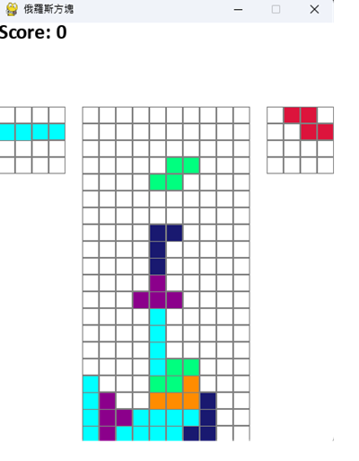
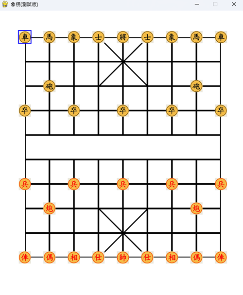

# python-game
簡單的俄羅斯方塊與象棋

## 使用 CMD 運行遊戲（Windows）

### 1. 下載專案
- 方式 A: Git clone
```cmd
git clone https://github.com/CLHiin/python-game.git
cd python-game
```
方式 B: 下載 ZIP → 解壓縮 → 進入資料夾

### 2.前置安裝
步驟A: 安裝python
步驟B: 前往cmd安裝pygame插件
```cmd
python -m pip install --upgrade pip
python -m pip install pygame
```

### 3.運行遊戲
簡單的使用 `python 遊戲名稱.py` 即可運行
製作時比較偏個人訓練，有一些操作方法沒有標示，並且輸入法得切英文
俄羅斯方塊: 上下左右(可wasd)，x可以交換方塊，空格鍵直接落底
象棋: 上下左右(可wasd)選擇棋子，使用K確認

### 4.遊戲畫面

